# Netra - System Architecture

Netra is designed as a unified CCTV registry (Model 1) and viewing/analytics platform (Model 2) for the state of Gujarat. A critical requirement of Model 2 is that **existing departmental Video Management Systems (VMS) remain completely unaffected**.

## Core Philosophy: The Non-Interference Guarantee

Netra operates entirely on an **Edge-Proxy and Central Metadata** architecture. 
- We do **NOT** modify, reconfigure, or install software on existing departmental cameras or NVRs.
- We do **NOT** pull massive 24/7 video streams into a central storage facility, which would destroy network bandwidth.
- We do **NOT** alter the existing departmental VMS platforms.

Instead, Netra acts as a read-only consumer of standard protocols (RTSP, HLS, ONVIF) exposed by the departmental systems, processing video at the edge and only transmitting lightweight metadata (license plates, vehicle colors, timestamps, cropped thumbnails) to the central command center.

## System Diagram

```mermaid
flowchart TD
    %% Existing Departmental Systems (Unaffected)
    subgraph Departmental Systems [Departmental CCTV & VMS]
        Cam1[Camera A]
        Cam2[Camera B]
        VMS[Existing Dept VMS]
        Cam1 --> VMS
        Cam2 --> VMS
    end

    %% Netra Edge Processing & Proxy
    subgraph Netra Edge Gateway [Netra Unified Stream Gateway & Edge Analytics]
        Proxy[HLS/RTSP Proxy - feeds.py]
        ANPR[ANPR Pipeline - pipeline.py]
    end

    %% Read-Only Connection
    VMS -.->|"Read-Only RTSP/HLS"| Proxy
    VMS -.->|"Read-Only RTSP/HLS"| ANPR

    %% Central Infrastructure
    subgraph Central Control Room [Netra Central Registry & Dashboard]
        API[FastAPI Backend]
        DB[(PostgreSQL + PostGIS)]
        UI[React.js Unified Viewer]
    end

    %% Data Flow
    Proxy ==>|"Live Stream Delivery (On Demand)"| UI
    ANPR ==>|"Metadata & Thumbnails Only (POST)"| API
    API <--> DB
    UI <--> API

    style Departmental Systems fill:#2D3748,stroke:#4A5568
    style Netra Edge Gateway fill:#2B6CB0,stroke:#3182CE
    style Central Control Room fill:#276749,stroke:#38A169
```

## Data Flow & Components

### 1. Unified Stream Gateway (Model 2)
The backend (`routers/feeds.py`) acts as a secure proxy. When an operator in the central control room opens the "Live Viewer", the backend authenticates with the departmental VMS and proxies the HLS/RTSP stream directly to the browser.
* **Why it's safe:** The stream is only pulled *on demand* when an operator is actively watching. If no one is watching, zero bandwidth is used. The departmental VMS simply sees Netra as another authorized viewing client.

### 2. Edge Analytics Pipeline
The ANPR pipeline (`anpr/pipeline.py`) runs close to the cameras (at the edge). It consumes the live RTSP stream, runs YOLOv8 for vehicle detection, OpenCV for colour, and EasyOCR for plate recognition.
* **Why it's safe:** The massive raw video data never leaves the edge location. Only kilobytes of data (the license plate string, color, and a cropped JPEG thumbnail) are POSTed to the central API.

### 3. Centralised Registry & Dashboard (Model 1)
The PostgreSQL database holds the metadata (camera locations, departments, health status) and the detection events. The React frontend (`pages/Registry.jsx` and `pages/Investigation.jsx`) allows operators to view GIS maps, trace vehicle routes, and monitor watchlist alerts.
* **Why it's safe:** The registry is entirely detached from the video feed layer. It scales with camera count, not video volume: mapping the state's ~80,000 cameras needs no video data at all.

## Technology Stack

* **Frontend:** React.js, Tailwind CSS, Leaflet (GIS)
* **Backend API:** FastAPI (Python), SQLAlchemy
* **Database:** PostgreSQL (with PostGIS for geographic queries)
* **Video Proxy:** HLS.js, HTTP/RTSP Session management
* **AI/ML Pipeline:** YOLOv8 (vehicle detection + ByteTrack tracking), EasyOCR (plate recognition), OpenCV
